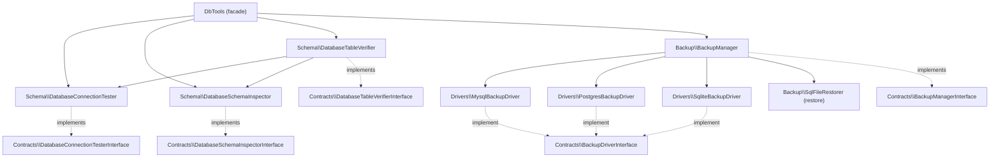

# Architecture

A high-level map of how `laranail/db-tools` is wired together. The
namespace root for every class is `Simtabi\Laranail\DbTools\`.

## Overview

The `DbTools` facade is a thin, static entry point. It resolves the
container-bound service contracts and delegates to them — it holds no state of
its own. The schema services each have a single responsibility (connection
testing, schema inspection, table verification), and `BackupManager` uses a
driver pattern to pick the right backup strategy per database driver.



Notably, `DatabaseTableVerifier` is constructed with the connection tester and
schema inspector contracts injected, so it composes the other two services
rather than re-querying the database directly.

## Dependency posture

`db-tools` is deliberately **light**, but it is no longer dependency-free. It
depends on `illuminate/*`, a few small utility libraries (`ramsey/uuid`,
`symfony/uid`, `spatie/laravel-sluggable`), and exactly one Laranail package:

| Dependency | What it is here for |
|---|---|
| `laranail/package-tools` | the provider base (`PackageServiceProvider` + `Package`), which mints the vendor-scoped config key and publish tags; the Artisan command base, which carries `SupportsNamespacedNames`; and `Commands\Concerns\ReadsOptions` |

That it is exactly one is deliberate. `ReadsOptions` was moved out of this
package into `laranail/package-tools` rather than `laranail/console`, even
though console is where command concerns otherwise live, because this package
already required package-tools and so the move cost consumers nothing. Routing
it through console would have meant a second Laranail dependency -- and
console's `require` is not a subset of package-tools', so it would have been new
weight reaching every consumer of this package for three accessors.

### What this section used to say, and why it changed

Until 0.9.0 this section asserted a hard **independence invariant**: that
`db-tools` never depended on `laranail/package-tools` or any other Laranail
package, and that the `require` block must stay free of every `laranail/*`
entry. That invariant was real, and it was argued for here on a specific case —
0.9.0's bare publish tags (`db-tools-config`) were the flat-global-map collision
the family's naming convention exists to prevent, and extending
`laranail/package-tools` (which mints namespaced tags automatically) was costed
and rejected because it removed about sixteen lines of registration plumbing and
the naming guard needed no dependency at all.

**That decision was then reversed, and this page was not updated.** 0.9.0 itself
shipped `laranail/package-tools` in `require` and made
`DbToolsServiceProvider` extend `PackageServiceProvider` — the exact change the
paragraph above had rejected. The prose kept asserting the invariant for three
weeks while the manifest contradicted it, and a local copy of
`SupportsNamespacedNames` kept citing the invariant as its reason to exist.

The lesson is narrower than "invariants are bad": **an invariant that lives only
in prose is not enforced, and a reversal will not update it.** If this posture
is to become a rule again, it needs a test that reads `composer.json`, not a
paragraph.

### What still holds

The reasoning that produced the original invariant has not gone away, and it is
still the right question to ask before adding a dependency here:

> Before taking a `laranail/*` dependency, write down what it actually removes,
> and check whether the thing you want can be asserted against the framework
> instead.

Concretely, for this package:

- **Consumers pull this package for database utilities**, often without wanting
  a package-author toolchain. Keep the dependency list short and justify each
  entry by what it deletes, not by what it tidies.
- **The naming guard stays framework-level.** `NamingConventionTest` reads
  Laravel's own `ServiceProvider::publishableGroups()` and `pathsToPublish()`, so
  it needs no Laranail dependency and would survive dropping one.
- **Seeding is not moving here.** It lives in `laranail/package-tools`, and the
  seed console formatter lives in `laranail/console`.

## Contracts

**`Schema/Contracts/`**

- `DatabaseConnectionTesterInterface` — `test`, `testDetailed`, `getDriver`,
  `getVersion`, `getDatabaseName`.
- `DatabaseSchemaInspectorInterface` — `getTables`, `hasTable`,
  `getTableCount`, `getColumns`, `hasColumn`, `hasColumns`.
- `DatabaseTableVerifierInterface` — `verify`, `verifyDetailed`,
  `getExistingTables`, `getMissingTables`, `hasLaravelTables`.

**`Backup/Contracts/`**

- `BackupManagerInterface` — `backup`, `restore`, `supportsDriver`.
- `BackupDriverInterface` — `backup(array $config, string $path)`, `supports`.

## `src/` tree

```
src/
├── DbTools.php              # static facade-style entry point
├── Facades/
│   └── DbToolsFacade.php    # Laravel Facade -> DbTools
├── Providers/
│   └── DbToolsServiceProvider.php
├── Schema/
│   ├── DatabaseConnectionTester.php
│   ├── DatabaseSchemaInspector.php
│   ├── DatabaseTableVerifier.php
│   ├── AuditColumnsMacro.php         # auditColumns() blueprint macro
│   ├── SoftDeletesWithUndoMacro.php  # softDeletesWithUndo() blueprint macro
│   ├── BlueprintMacros.php           # extended Blueprint (configurable id type)
│   ├── Concerns/                     # HasSchemaInspection, HasSchemaOperations
│   └── Contracts/
├── Backup/
│   ├── BackupManager.php
│   ├── SqlFileRestorer.php
│   ├── Drivers/
│   │   ├── MysqlBackupDriver.php
│   │   ├── PostgresBackupDriver.php
│   │   └── SqliteBackupDriver.php
│   └── Contracts/
├── Concerns/                      # model traits (UUID/ULID/NanoID, scopes, …)
├── Casts/
│   ├── CastMoney.php
│   └── CastDatetime.php
├── Observers/
│   └── AuditObserver.php
├── Events/
│   ├── BaseEvent.php
│   └── DatabaseEvents.php
├── Models/
│   └── BaseModel.php               # optional base Eloquent model
├── Exceptions/
├── Files/
└── Services/
```

## See also

- [facade.md](tools/facade.md) — the unified entry point
- [backup-restore.md](tools/backup-restore.md) — driver resolution flow
- Worked example: [`docs/examples/Order.php`](examples/Order.php) +
  [`docs/examples/OrderMigration.php`](examples/OrderMigration.php)

---
[← Docs index](../README.md#documentation)
